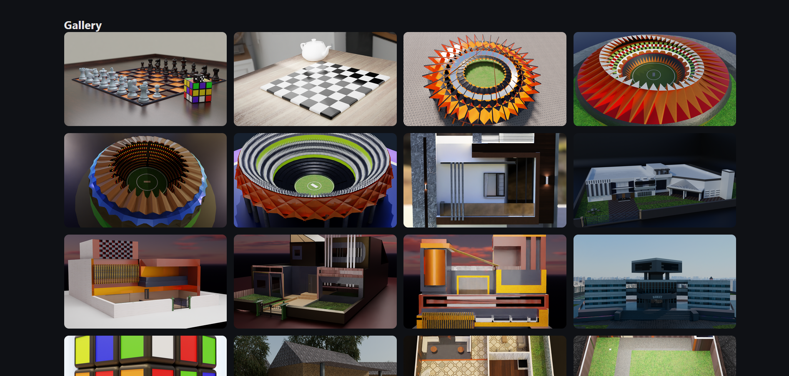
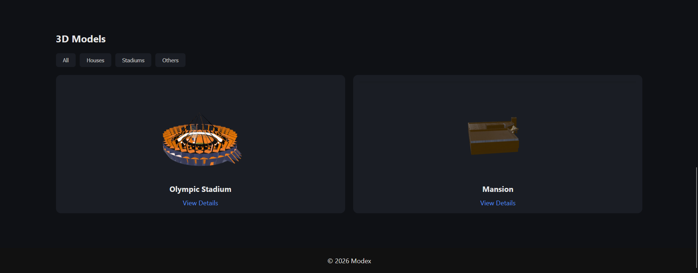
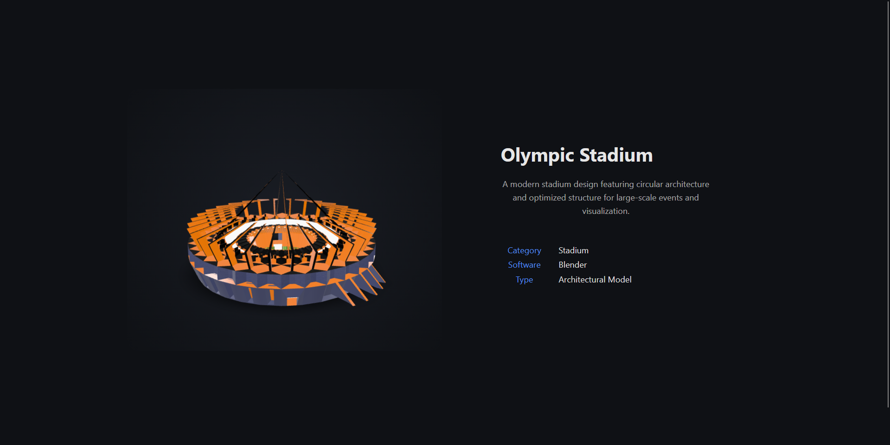

# 🧊 Modex — Interactive 3D Models Showcase

<p align="center">
  <b>Where Models Come Alive</b>
</p>

<p align="center">
  A modern, interactive platform to explore and experience 3D models directly in the browser.
</p>

---

## 🚀 Live Demo

> 🔗 https://modexrawjet.netlify.app

---

## 🛠️ Tech Stack

<p>
  
  
  
  
  
</p>

---

## ✨ Features

* 🎨 Interactive **Image Gallery** with fullscreen viewer
* 🧊 Real-time **3D Model Rendering**
* 🔍 Category-based **Filtering System**
* ⚡ Smooth UI with hover + transition effects
* 📱 Fully **Responsive Design**
* 🎬 Advanced **Popup Viewer (Navigation + Keyboard Controls)**
* 🎯 Clean and minimal **Product-style UI**

---

## 📸 Screenshots

### 🖼️ Gallery View



### 🧊 Models Section



### 🔍 Model Detail Page



---

## 🧱 Project Structure

```
3d-models-viewer-website/
│
├── index.html
├── views/
│   ├── house.html
│   ├── mansion.html
│
├── public/
│   ├── models/
│   ├── images/
│   ├── stylesheets/
│   │   ├── style.css
│   │   ├── details.css
│   ├── javascripts/
│   │   ├── script.js
│   ├── favicon/
```

---

## ⚙️ Getting Started

### 1. Clone the repository

```bash
git clone https://github.com/your-username/modex.git
```

### 2. Open the project

```bash
cd modex
```

### 3. Run locally

* Open `index.html`
  OR
* Use VS Code Live Server

---

## 🧊 How It Works

1. Browse models via gallery or model grid
2. Filter models by category
3. Click a model to view details
4. Interact with the model (rotate, zoom, inspect)

---

## 🎨 Design Principles

* Minimalistic & distraction-free
* Visual-first approach
* Smooth interactions
* Consistent dark theme
* Product-level UI/UX

---

## 🚀 Future Enhancements

* 🔄 Smooth animated filtering
* 🔍 Search functionality
* 🌐 Deployment (Netlify / Vercel)
* ⚡ Performance optimization (lazy loading)
* 🎮 Advanced 3D interactions

---

## 📌 Notes

* All models are exported in `.glb` format
* Built using static frontend architecture
* Optimized for performance and simplicity

---

## 👨‍💻 Author

**Tejwardeep Singh**
B.Tech CSE | Full Stack Developer

---

## ⭐ Support

If you like this project:

* ⭐ Star the repository
* 🍴 Fork it
* 🧠 Contribute ideas

---

<p align="center">
  <b>Built with passion for 3D and web interaction</b>
</p>
